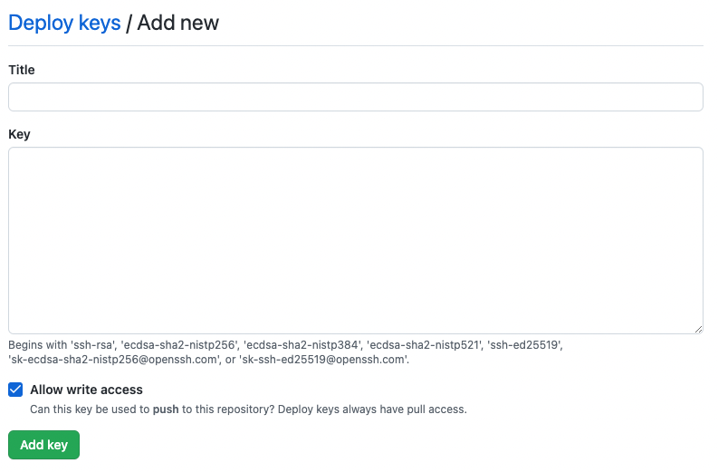
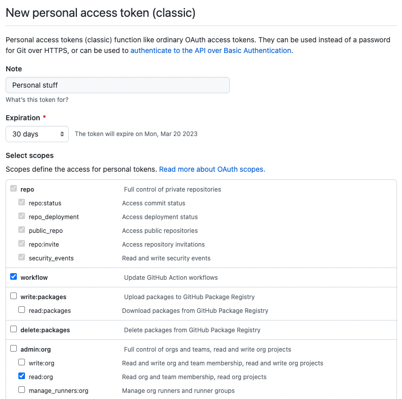
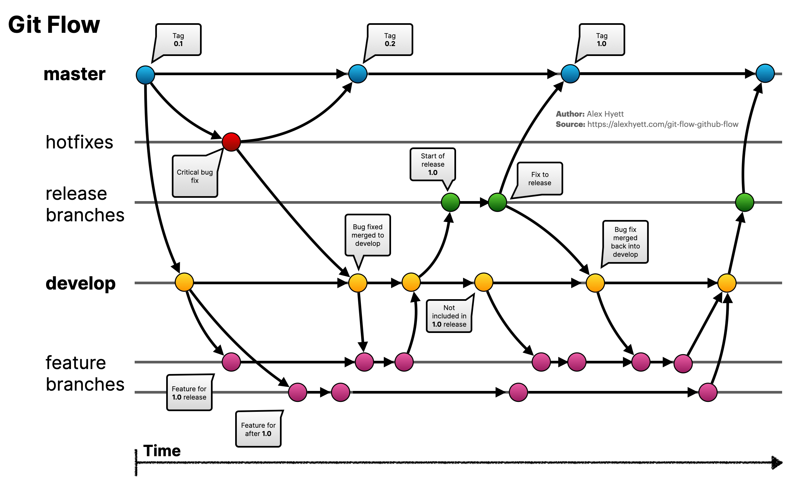
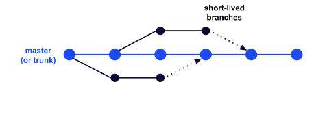

# Introducción al control de versions amb GitHub


Per clonar-vos aquest repostitori feu:

```code
git clone https://github.com/carlesalonso/IntroduccioGitHub.git
```

A la carpeta *files* teniu la presentació en format PDF, un full de consulta ràpid de comandes git i un full d'exercicis per practicar.

## Continguts

### Instal·lació

-[https://git-scm.com/download](https://git-scm.com/download)

### Configuració

  ```console
   # Opcions obligatòries (nom i correu)
   git config --global user.name "Nom i cognom"
   git config --global user.email correu@electronic

   # Editor de preferència. Exemple Visual Studio Code
   # Referencia: https://stackoverflow.com/questions/30024353/how-to-use-visual-studio-code-as-default-editor-for-git
   git config --global core.editor "code --wait"
```

### Creació de repositoris

Per crear un repositori cal posar-s'hi dins la carpeta desitjada i fer:

 ```console
 git init
 ```

Alternativament, podem crear la carpeta del repositori:

 ```console
 git init nom_carpeta
```

### Cicle de vida


### Revisant l'estat

```console
 git status
```

 Esquema de colors:

- *Vermell* - Identifica els arxius *modificats o nous*. Si es creen arxius dins de carpetes noves, *git status* només mostrarà el nombr de la carpeta, no el seu contingut. Si es vol veure el contingut de les carpetes noves s'ha d'executar *git status -u*.
- *Verd* - Identifica els arxius a l'*àrea de preparació*.

### Visualitzar canvis

 Mostra diferència entre directori de treball i staged

```console
 git diff
 git diff <arxiu>
```

Per mostrar canvis entre staged i el repositori

 ```
 git diff --cached
 git diff --cached <arxiu>
```
  
### Afegir arxius l'àrea de preparació (stage)

```
 git add <arxiu> # Afegir arxius
 git add .       # Afegir tots els arxius nous o modificats
```

 L'àrea de preparació* conté els canvis que s'afegiran a la nova versió quan executem un *commit*. És possible la següent situació:

- Modificar un fitxer (apareixerà en color vermell en fer un *git status*)
- Afegir el fitxer a l'àrea de preparació mitjançant *git add FITXER*
- El fitxer apareixerà en color *verd* en fer un *git status*
- Tornar a modificar el fitxer
- El fitxer apareixerà *dues vegades* en fer un *git status*:
   - En color verd, indicant que s'ha afegit el primer canvi a l'àrea de preparació
   - En color *vermell*, indicant que hi ha un "segon canvi" posterior que *no s'ha inclòs* a l'àrea de preparació
- Si s'executa un ^git commit *en aquest moment* només s'incorporarà el primer canvi* al repositori com a nova versió. El segon canvi continuarà existint (l'arxiu no haurà canviat), però no estarà guardat al commit
- Si voleu afegir el segon canvi s'haurà d'executar novament *git add* per afegir-lo a l'àrea de preparació

### Visualitzar canvis dels fitxers a l'àrea de preparació

 ```
 git diff --staged
 git diff --staged <arxiu>
```

Visualitzar canvis dels fitxers a l'àrea de preparació:

### Confirmar canvis (commit)

 ```
 git commit -m "missatge"
 ```

Un commit equival a una nova *versió* al repositori. Cada commit té un *identificador únic*, anomenat ~hash~. Els commits estan relacionats entre si mitjançant una *xarxa de tipus graf*.

### Ignorar arxius

- Arxiu *.gitignore*
- Plantilles d'arxius [.gitignore](https://github.com/github/gitignore).

Les rutes i noms de fitxer que apareguin al fitxer *.gitignore* seran ignorades per *git* **sempre que no hagin estat afegides prèviament a l'àrea de preparació o al repositori**. Per exemple, si afegim un fitxer a l'àrea de preparació mitjançant *git add* i tot seguit l'afegim al fitxer *.gitignore*, *git* el seguirà mantenint a l'àrea de preparació, per la qual cosa serà inclòs al repositori si executem un fitxer *git commit*.

De la mateixa manera, si prèviament hem guardat un arxiu al repositori mitjançant *git commit* ia continuació l'incloem al fitxer *.gitignore*, git no l'esborrarà: caldrà esborrar-lo del sistema de fitxers (a través de la consola o el navegador de fitxers) i afegir els canvis (*git add* i *git commit*) perquè s'esborri del repositori. Un cop esborrat, si el tornem a crear veurem que *git* sí que ho ignora si està inclòs al fitxer *.gitignore*.

### Historial de canvis

 ```
 git log
 git log --graph
 ```

Aquesta ordre mostra l'històric dels commits del repositori. Es pot navegar a la llista mitjançant els cursors i la barra espaiadora. Per sortir cal prémer la tecla *q*.

### Veure canvis realitzats en anteriors commits

```console
 git show <commit>
```

Aquesta ordre ens permet mostrar els canvis que es van introduir en un determinat commit. En primer lloc es pot executar *git log* per cercar el hash del commit que ens interessi i tot seguit executar *git show* indicant després el hash del commit corresponent.

Els hash dels commits tenen 40 caràcters, però no cal copiar-los sencers: només cal indicar entre els [8 i 10 primers caràcters](http://git-scm.com/book/en/v2/Git-Tools-Revision-Selection#Short-SHA-1) per identificar un commit correctament.

### Comparar entre diferents commits

També podeu trobar diferències entre versions d'un mateix fitxer, per això utilitzem els identificadors dels commit.

```console
 git diff f2c4ec0 2ca00f8
 ```

### Treure fitxer de l'àrea de preparació

```
 git reset <arxiu>
```

De vegades ens trobem que hem afegit canvis a l'àrea de preparació que no volem incorporar al commit. Per això podem utilitzar aquesta ordre, que elimina els canvis del fitxer corresponent de l'àrea de preparació. *Els canvis no es perden* en cap cas.

### Eliminar les modificacions respecte a l'stage

```
git restore <archivo>
```
També es pot fer d'aquesta forma (mètode anterior a l'aparició del *git restore*)

```console
git checkout -- <arxiu>
```

### Etiquetat

```console
git tag TAG
```

Exemple:

```console
git tag -a 0.0.1 -m "Release version 0.0.1"
```

Aquesta ordre crea un *tag* al commit on ens trobem en aquest moment. Un *tag* és un àlies que s'utilitza per fer referència a un commit sense necessitat de saber el seu hash. Normalment s'utilitza per a *indicar números o noms de versions* associades a un determinat commit. D'aquesta manera podem identificar una versió d'una manera més amable. Hi ha un estàndard a l'etiquetatge del programari anomenat [versionat semàntic](https://semver.org/lang/es/).

### Eliminar commits

```console
git reset id_commit
```

```console
git reset HEAD~1
```

Això elimina l'història fins el commit indicat en el primer cas i en el segon desfaria el darrer commit (ens anem al HEAD-1) Existeixen bàsicament dues opcions:

```console
git reset ---soft
git reset ---hard
```

En el primer cas, tot i que movem l'historial fins el el commit indicat, no es modifica el stage ni el working directory, per tant, conservem els darrers canvis. Si fem la segona opció, el directori de treball també es modifica.

### git revert

Similar a l'anterior en el sentit que volem tirar enrere l'historial, però amb la diferència que enlloc d'eliminar commits, fa un commit nou amb l'estat del commit indicat.

```console
git revert --no-edit HEAD~4
``````

Aquesta comanda faria un nou commit replicant la versió corresponent al HEAD-4, també es pot indicar el id del commit.

### Branques

Una branca (branch) és una línia independent de desenvolupament: per tant, amb el seus propis working directory, staging area i project history (git directory). Com a mínim un repositori ha de tenir una branca. La branca inicial es ```master``` o ```main```. Existeix un punter especial que apunta a la branca activa en aquell moment i que s'anomena ```HEAD``.

Al canviar de branca es modifica el contingut del directori de treball a l'estat que tenia amb la branca destinació.

### Crear branques

```console
git branch nom_branca
```

Si volem veure les branques que tenim definides:

```console
git branch
```

### Canviar de branca

La comanda tradicional per canviar de branca i que encara funciona és ```git checkout``` tot i que actualment tenim també l'opció d'utilitzar ```git switch```.

```console
git checkout dev
git switch main
```

### Fusionar branques

Combinar una branca, en anglès *merge*, consisteix a incorporar els canvis presents en una branca a la branca en la qual ens trobem actualment. Per dur a terme una fusió, s’han de dur a terme les accions següents:

1. Posicionar-nos a la branca que volem que rebi la fusió, és a dir, la destinatària.
2. Per realitzar la fusió tenim dues comandes que podem utilitzar:

    ```console
    git merge nom_branca
    git rebase nom_branca
    ```

La fusió fa que els commits de totes dues branques. En el cas del *merge*, aquesta unió manté la història de les dues branques. Mentre que el rebase reescriu la història com si no hi hagués cap bifurcació. Una pràctica recomanda és no usar mai *rebase* en branques públiques.

Podem veure que en el *merge* els commits corresponents a les dues branques són clarament visibles:


Si es fa un *rebase* es veu com es modifica la història, entrellançant els commits de les dues branques:


### Fusió amb conflictes

Quan es fa la fusió de dues branques, pot passar que no ens deixi fer-la automàticament perquè n'hi ha conflictes (dues branques modifiquen la mateixa línia). En aquest cas, ens tocarà solucionar-lo. Usant un editor com Code, veurem que ens mostra les dues opcions i ens permetrà triar quina és la solució que volem que quedi com definitiva.

### stash o temporal

Quan estem editant un branca, pot passar que tinguem canvis que encara no volem consolidar (fer un commit) però que necessitem canviar de branca per exemple per solucionar un petit error.

Si canviem de branca amb canvis no confirmats (al working directory o al stage) al canviar de branca arrosseguem aquests canvis i òbviament, això pot tenir conseqüències no desitjades.

Per evitar-lo fer una solució semblant a retallar i enganxar del portapapers dels sistemes operatius.

```console
git stash
```

Això treurà temporalment els canvis que no tinguem consolidats i els guarda al stash. Ja podrem canviar de branca i al tornar, podem recuperar aquests canvis fent:

```console
git stash pop
```

### Eliminar branques

Normalment, un cop una branca ha estat fusionada cap una altra, l'eliminarem.

```console
git branch -d nom_branca
```

Si volem esborrar una branca que no ha estat fusionada, cal usar la següent comanda:

```console
git branch -D nom_branca
```

### Clonant un projecte des de GitHub

La comanda per clonar un projecte és ```git clone```.

Hi ha dues vies per "descarregar" el contingut:

1. Via `ssh` utilitzant **clau pública/privada**.
2. Via `https` utilitzant **usuari/token**.

#### Clonat mitjançant ssh

Si intentem clonar un repositori via ssh obtindrem el següent error:

```console
cam@molnir:~$ git clone git@github.com:cam/webprova.git
Clonando en 'webprova'...
git@github.com: Permission denied (publickey).
fatal: No se pudo leer del repositorio remoto.

Por favor asegúrate que tienes los permisos de acceso correctos
y que el repositorio existe.
```

Hi ha un error daccés ja que necessitem establir les claus adequades. El primer serà generar un parell de claus pública/privada (si és que ja no les hem generat):

```console
cam@molnir:~$ ssh-keygen -t rsa
Generating public/private rsa key pair.
Enter file in which to save the key (/home/cam/.ssh/id_rsa):
Created directory '/home/cam/.ssh'.
Enter passphrase (empty for no passphrase):
Enter same passphrase again:
Your identification has been saved in /home/cam/.ssh/id_rsa
Your public key has been saved in /home/cam/.ssh/id_rsa.pub
The key fingerprint is:
SHA256:NE+B9Q62B6KKqVivlXKB+vUvz/mOPoXKXGUWI1aEEEQ cam@molnir
The key's randomart image is:
+---[RSA 3072]----+
|     oEo *=      |
|        = oo     |
|       .+.=o.    |
|   .   o *+=     |
|  . . . S=o o    |
| . o +  o ..     |
|. = *o o .       |
|.+ * .=..o       |
|o o.. .=B+o      |
+----[SHA256]-----+
```

Comprovem la generació de les claus:

```console
cam@molnir:~$ ls .ssh
id_rsa  id_rsa.pub
```

Ara hem de copiar la **clau pública `aneu_rsa.pub`** en GitHub. Per a això hem d'afegir una nova "clau de desplegament" anant a una url com aquesta
: <https://github.com/daw-mataro-epiaedu/webprova/settings/keys>

> 💡 Substitueix `carlesalonso` pel teu usuari i `webprova` pel nom del teu projecte.

Al camp **Title** una bona pràctica és posar el nom de la màquina i al camp **Key** posem el contingut de la clau pública `id_rsa.pub` marcant el check de **Allow write access**.



Ara ja podem clonar el repositori sense problemes:

```console
cam@molnir:~$ git clone git@github.com:carlesalonso/webprova.git
Clonando en 'webprova'...
warning: Pareces haber clonado un repositorio sin contenido.
```

Efectivamente el repositorio está vacío:

```console
cam@molnir:~$ ls -l webprova/
total 0
```

> 💡 És possible afegir claus públiques a nivell dusuari GitHub i servirà per a qualsevol projecte creat. Això es fa des de la url <https://github.com/settings/keys>.

#### Clonat mitjançant https

Sempre que el repositori sigui **públic** no hi ha cap problema per clonar-lo a través de https:

```console
cam@molnir:~$ git clone https://github.com/carlesalonso/webprova.git
Clonando en 'webprova'...
warning: Pareces haber clonado un repositorio sin contenido.
```

Vegem què passa si canviem els permisos al repositori GitHub i ho posem **privat**:

```console
cam@molnir:~$ git clone https://github.com/carlesalonso/webprova.git
Clonando en 'webprova'...
Username for 'https://github.com': carlesalonso
Password for 'https://carlesalonso@github.com':
remote: Support for password authentication was removed on August 13, 2021.
remote: Please see https://docs.github.com/en/get-started/getting-started-with-git/about-remote-repositories#cloning-with-https-urls for information on currently recommended modes of authentication.
fatal: Autenticación falló para 'https://github.com/carlesalonso/webprova.git/'
```

Hem de [crear un "token" d'accés personal](https://docs.github.com/es/authentication/keeping-your-account-and-data-secure/creating-a-personal-access-token) a la següent url de GitHub: <https://github.com/settings/tokens/new> indicant:

| Camp          | Contingut                                                               |
| ------------- | ----------------------------------------------------------------------- |
| Note          | Explicació de l'ús del token                                            |
| Expiration    | Durada del token                                                        |
| Select scopes | Àmbits d'aplicació. Marcar com a mínim: `repo`, `workflow` i `read:org` |



Quan es generi el token **cal copiar-lo** perquè no es tornarà a mostrar.

Ara sí que podrem clonar el repositori privat sense cap problema:

```console
cam@molnir:~$ git clone https://github.com/carlesalonso/webprova.git
Clonando en 'webprova'...
Username for 'https://github.com': carlesalonso
Password for 'https://carlesalonso@github.com':
warning: Pareces haber clonado un repositorio sin contenido.
```

> 💡 Al camp "password" introduïm el token creat prèviament.

### Gestionar origens remots

Al clonar per defecte s'associa com *origin* l'adreça del repositori del qual s'ha fet la clonació. A vegades és útil tenir més d'una adreça remota, per exemple, si hem fet un fork d'un repo i volem sincronitzar el repositori local amb els canvis del repositori original.

```console
git remote add remot git@github.com:carlesalonso/webprova.git
```

Es podem veure quins repositoris remots tenim vinculats amb ```git remote -v```.

Altres opcions són eliminar origens remots ```git remote rm nom``` o canviar el nom d'un origen remot ```git remote rename nom_vell nom_nou```.

### git push

Serveix per actualitzar el repositori remot. Format:

```console
git push origin main
```

En aquest cas diem que pugem els canvis corresponents a la branca *main*.

Si volem pujar tots els canvis corresponents a totes les branques:

```console
git push --all origin
```

Si al push se li afegeix el paràmetre ```---force```, estem dient que pugi el contingut local, descartant els canvis que es trobi a dalt.

### git pull

Serveix per baixar el contingut remot i actualitzar el repositori local.

 ```console
 git pull remote
 ```

De la mateixa manera que amb el pull, ```---force``` forçarà que s'apliquin els canvis remots, descartant els locals.

### git fetch

Similar al pull, però no realitza la fusió, sinó que simplement sincronitza els canvis i queda a l'espera de la fusió.

```console
git fetch origin main
git merge
```

La utilitat ens que ens permet revisar i comparar (```git diff```) abans de fusionar contingut local i contingut remot.

### Branques remotes

Quan clonem un repositori que conté més d’una branca.
Si fem git branch només es veu master, però si fem git branch –a veiem totes les branques remotes també.
Per activar les branques en local, simplement cal canviar a la branca:

```console
git switch nom_branca
```

## Col·laboració via pull request

Aquesta és la metodologia típica quan es vol col·laborar en un projecte *open source*, tot i que també és una molt bona estratègia amb repositoris privats, de manera que els col·laboradors enlloc de clonar-se directament el repositori, es fan una bifurcació (*fork*) al seu GitHub i envien els canvis seguint el mètode que ara es descriu que s'anomena [pull request](https://docs.github.com/pull-requests).

Plantejarem un escenari en què una altra persona `calonsmar` vol col·laborar amb el nostre projecte `webprova` (que és privat)seguint un model molt habitual al món "open-source". Per això, cal que l'haguem definit al repositori com col·laborador. Si és un repositori personal, el col·laborador té tots els permisos, però amb un repositori d'organització, li podem dir que només tingui permís de lectura.

Si es tractés d'un repositori públic, aquest pas no seria necessari perquè qualsevol usuari de GitHub pot fer la bifurcació.

### Bifurcar el projecte

El col·laborador rebrà una notificació conforme se li han donat permisos per col·laborar al repositori i un cop oberta, haurà d'acceptar la invitació.

Un cop fet això, el col·laborador ja veu el repositori i pot fer fork. Si es tracta d'un repositori públic directament podrà fer el fork al veure el repositori.

### Clonar la bifurcació

El primer que ha de fer calonsmar és clonar el seu propi repositori:

```console
calonsmar@orange:~$ git clone git@github.com:calonsmar/webprova.git
Clonando en 'webprova'...
remote: Enumerating objects: 20, done.
remote: Counting objects: 100% (20/20), done.
remote: Compressing objects: 100% (9/9), done.
remote: Total 20 (delta 5), reused 17 (delta 3), pack-reused 0
Recibiendo objetos: 100% (20/20), listo.
Resolviendo deltas: 100% (5/5), listo.
```

A l'hora de col·laborar les bones pràctiques demanen crear una branca de treball:

```console
calonsmar@orange:~$ cd webprova/
calonsmar@orange:~/webprova$ git switch -c colab
Cambiado a nueva rama 'colab'
calonsmar@orange:~/webprova$ vi README.md
calonsmar@orange:~/webprova$ cat -n README.md
     1  # webprova
     2
     3 Projecte base per fer proves.
     4
     5 Col·laborant en mode "open-source"
     
calonsmar@orange:~/webprova$ git commit -am "Add brief notes about colab"
[colab 2ca00f8] Add brief notes about colab
 1 file changed, 2 insertions(+)
```

### Preparant un "pull request"

Ara farem un `git push` per pujar els canvis al repositori de `calonsmar`:

```console
calonsmar@orange:~/webprova$ git push origin colab
Enumerando objetos: 5, listo.
Contando objetos: 100% (5/5), listo.
Compresión delta usando hasta 2 hilos
Comprimiendo objetos: 100% (2/2), listo.
Escribiendo objetos: 100% (3/3), 321 bytes | 321.00 KiB/s, listo.
Total 3 (delta 1), reusado 0 (delta 0), pack-reusado 0
remote: Resolving deltas: 100% (1/1), completed with 1 local object.
remote:
remote: Create a pull request for 'colab' on GitHub by visiting:
remote:      https://github.com/calonsmar/webprova/pull/new/colab
remote:
To github.com:calonsmar/webprova.git
 * [new branch]      colab -> colab
```

Ens indica la possibilitat de crear un "pull request" anant a *Contribute*. Abans ens hem d'assegurar que no tenim cap commit per darrere del repositori original, per sincronitzar-nos, hi ha el botó *Sync fork*. Un cop sincronitzat, ja podrem proposar els canvis.

A la proposta de *pull request* hem de detallar què proposem: això es pot acompanyar de fragments de codi, de referències a incidències, etc. Un cop fet, ja podem clicar a "Create pull request".

En aquest moment, haurà arribat una notificació a `carlesalonso` informant-lo que existeix un "pull request" per a `webprova` pendent de revisió.

### Revisió del "pull request"

Ara el propietari, en aquest cas carlesalonso, obre el *pull request* i pot veure la proposta realitzada.

GitHub informa si pot fer la fusió de la proposta de forma automàtica o no. De tota manera, sempre és recomanable comprovar quins canvis s'estan proposant, perquè una proposta pot no donar problemes de fusió però no tenir un comportament desitjat. Si cliquem sobre el commit de la proposta, ens anem a una pantalla de revisió de codi.

Allà podem revisar el codi i enviar feedback al col·laborador, indicant si el canvi s'aprova, es rebutja demanant canvis o simplement s'envia el comentari.

Un cop de tornada a la pantalla del pull request, podem introduir els canvis proposats (*Merge pull request*), un cop us demanarà que ho confirmeu.

Per últim queda el pas de tancar el *pull request*, aquí és important documentar els canvis que ha incoporat el pull request.

En els casos que la revisió de la proposta requereixi per exemple compilar, llençar tests, etc. el procediment és baixar-se en local la proposta. El procediment és aquest:

```console
carlesalonso@molnir:~/webprova$ git fetch origin pull/1/head:test
```

Amb això estic sincronitzant una branca local anomenada **test** que té el contingut del pull request (el número serveix per identificar quin pull request és i amb el head indiquem que baixem l'estat corresponent al darrer commit).

Allà podem verificar el codi, fer un merge a la branca local **dev** per comprovar el correcte funcionament i si tot és correcte, acceptar el pull request.

És molt important que un cop s'ha acceptat un pull request, el col·laboradors actualitzin la branca bifurcada, de fet se'ls mostra el missatge que estan per darrere.

 Un cop fet això, hauria de sincronitzar els canvis amb un `git pull origin master`, cosa que també hauria de fer el propietari del repositori per tenir el repositori local actualitzat. Finalment, s'haurien d'esborrar les branques implicades en el pull request.

## Altres comandes interessants

| Comanda         | Descripció                                                        |
| --------------- | ----------------------------------------------------------------- |
| git blame       | Permet buscar responsables de cada canvi                          |
| git cherry-pick | Permet aplicar un commit específic                                |
| git clean       | Permet esborrar arxius sense seguimient                           |
| git gc          | Permet optimizar l'espai del repositori local                     |

I una llista [enorme](https://git-scm.com/docs/git#_git_commands) d'ordres...

## Estratègies de treball amb branques

En un projecte on hi col·labora tot un equip de desenvolupadors, QA, etc. cal establir una metodologia per evitar conflictes, treballar amb codi desactualitzat, etc. Per aquest motiu s'introdueixen els fluxes de treball (workflow). Existeixen diverses opcions, que no s'han d'entendre com que una és millor que l'altra, sinó que cadascuna s'adapta millor a una determinada situació.

Les diferències entre els diferents fluxes es basa a l'estratègia que prenen a l'hora de crear les branques. Els principals workflow que s'utilitzen actualment són:

- Git Flow
- GitHub Flow
- Trunk-based development

#### Git Flow

Considerat que és una mica complicat i avançat per a molts dels projectes actuals, GitFlow permet el desenvolupament paral·lel on els desenvolupadors poden treballar per separat de la branca mestra en funcions on es crea una branca de funcions a partir de la branca mestra. Després, quan els canvis s'han completat, el desenvolupador torna a fusionar aquests canvis a la branca mestra per al seu llançament.

Aquesta estratègia de ramificació consta de les branques següents:

- **Master/Main**
- **Develop**
- **Features**: per desenvolupar noves funcions que es ramifiquen de la branca de desenvolupament
- **Release**: ajuda a preparar un nou llançament de producció; generalment es ramifica de la branca de desenvolupament i s'ha de tornar a fusionar amb el desenvolupament i el mestre
- **Hotfix**: també ajuda a preparar-se per a un llançament, però a diferència de les branques de llançament, les branques de hotfix sorgeixen d'un error que s'ha descobert i s'ha de resoldre; permet als desenvolupadors seguir treballant en els seus propis canvis a la branca de desenvolupament mentre es corregeix l'error.

Les branques **main** i **develop** es consideren les branques principals, amb una vida útil infinita, mentre que la resta són branques de suport que estan pensades per ajudar al desenvolupament paral·lel entre desenvolupadors, normalment de curta durada.



#### GitHub Flow

És una simplificació de GitFlow per projectes o no calgui mantenir un versionat. A diferència de GitFlow, aquest model no té branques de llançament. Comenceu amb la branca principal i després els desenvolupadors creen branques, amb branques que provenen directament del mestre, per aïllar el seu treball que després es fusionen de nou amb el principal. Aleshores s'elimina la branca de les funcions.

La idea principal d'aquest model és mantenir el codi mestre en un estat desplegable constant i, per tant, pot suportar processos d'integració i lliurament continus.


#### Trunk-based development

El desenvolupament basat en troncs és una estratègia de ramificació que, de fet, no requereix cap branca, però, en canvi, els desenvolupadors integren els seus canvis en un tronc compartit almenys una vegada al dia. Aquest tronc compartit hauria d'estar llest per al seu llançament en qualsevol moment.

La idea principal d'aquesta estratègia és que els desenvolupadors facin canvis més petits amb més freqüència i, per tant, l'objectiu és limitar les branques de llarga durada i evitar conflictes de fusió, ja que tots els desenvolupadors treballen a la mateixa branca. En altres paraules, els desenvolupadors es comprometen directament al tronc sense l'ús de branques.

En conseqüència, el desenvolupament basat en tronc és un activador clau de la integració contínua (CI) i el lliurament continu (CD) ja que els canvis es fan amb més freqüència a la troncal, sovint diverses vegades al dia (CI), la qual cosa permet que les funcions s'alliberin molt més ràpidament (CD).




## Links

- [Git](https://git-scm.com)
- [GitHub](https://github.com)
- [The Official GitHub Training Manual](https://githubtraining.github.io/training-manual/#/)
- [Pro Git. Llibre en format electrònic](https://git-scm.com/book/es/v2)
- [Learning Git branching](https://learngitbranching.js.org/?locale=es_ES)
